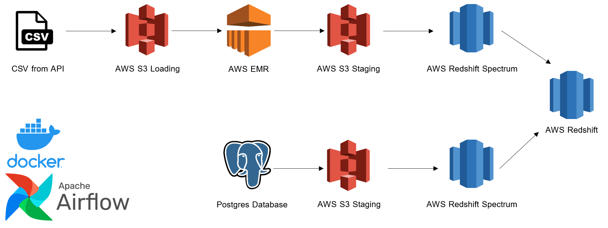
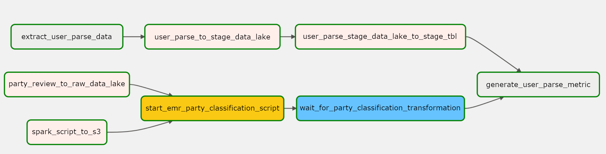

# Batch DE Project - FFLOGS Group Composition Analyzer

The repository is a stripped down batch ETL data pipeline project.

## Introduction

The purpose of this project is to combine Apache Airflow, PySpark, Docker, and AWS (S3, EMR, and Redshift) into a data pipeline. 

## Architecture Overview

Data for the CSV and Postgres Database were sourced from https://www.fflogs.com/v2-api-docs/ff/ by using Insomnia (https://insomnia.rest/).

## ETL Workflow

Since order does not matter in a party, but duplicates are allowed, a normal nCr calculation does not work. 
A combinations with repititions formula must be used, where:
	n is number of objects in a set
	r is length of a combination to be chosen
	C is number of possible combinations
	C = (n + r - 1)! / (r! * (n - 1)!)

If we allow for non-distinct classes for a 2/2/4 party size of 8 there are:
	10 tank combinations (4 tank classes and 2 tank spots per party),  
	6 healer combinations (3 healer classes and 2 healer spots per party),
	715 dps combinations (10 dps classes and 4 dps spots per party).

In total, there are 10*6*715 (42900) different possible party combinations.