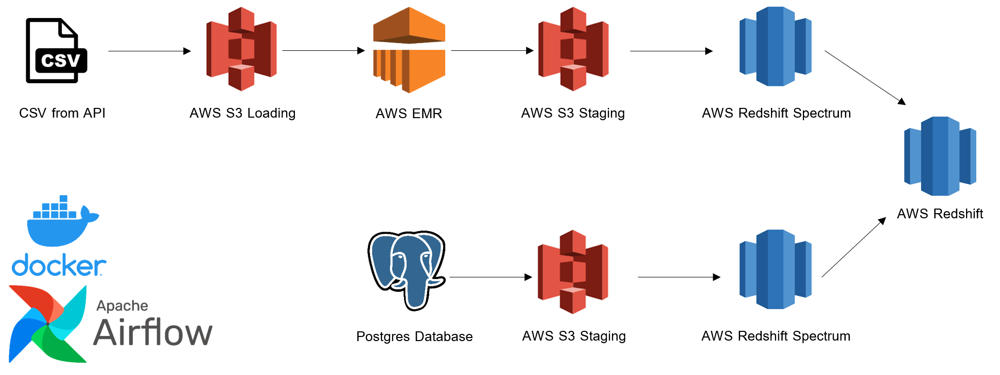
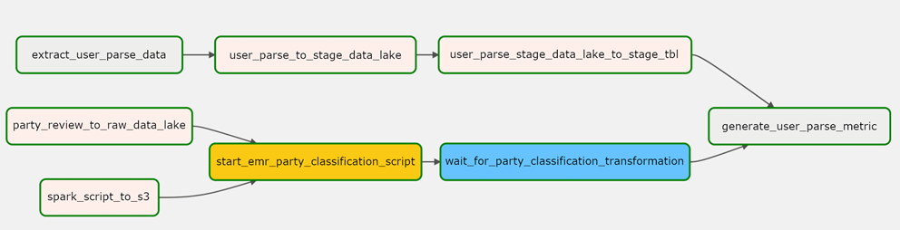
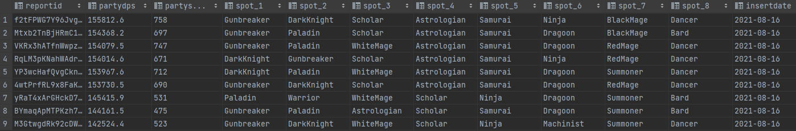
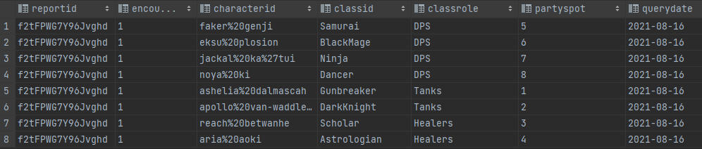
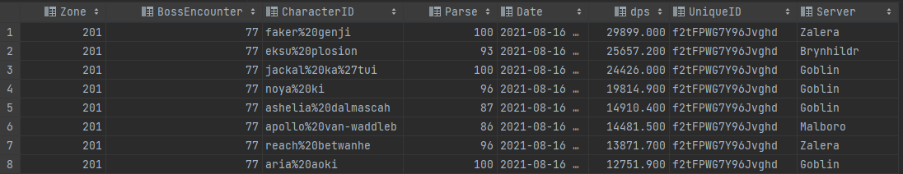

# Batch DE Project - FFLogs Group Composition Analyzer

The repository is a stripped down batch ETL data pipeline project.

## Introduction

The purpose of this project is to combine Apache Airflow, PySpark, Docker, and AWS (S3, EMR, and Redshift) into a data pipeline.  
Relevant code pertaining to the DAG, PostgreSQL Server, and Redshift setup can be found in their relevant folders.  
PySpark and python code are found in the dags folder.

## Architecture Overview
This is the general flow of the pipeline, where two sources of data from a local CSV file and a SQL database are passed through a batch ETL pipeline.

Data for the CSV and Postgres Database were sourced from https://www.fflogs.com/v2-api-docs/ff/ by using Insomnia (https://insomnia.rest/).

## Pipeline Workflow

**Top Path**  
The top path takes data from a local CSV and loads the data into a S3 loading area.  
While this happens, the EMR steps are loaded into S3.  
When the data is fully loaded into S3 and the EMR steps are uploaded, the EMR cluster runs a PySpark script on the data.  
The EMR Step Sensor now waits for the EMR steps to be complete.

**Bottom Path**  
The bottom path uses a Postgres database run on Docker.  
New data is extracted from a CSV and added to the Postgres database.  
The data from Postgress is uploaded to S3 staging area.  
In the S3 staging area, the data is placed in a table partitioned by insertion date.  
The bottom path is now complete and waits for the top path EMR steps to complete.

**Completion**  
Now that both the top and bottom path are complete, Redshift can now return a report.  
The resulting table from the query is shown below.

Redshift Query Report:

## Data Tables
FFLogs API Data in CSV:

Postgres SQL Data:

