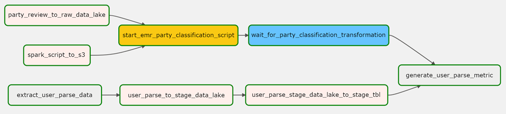

# Batch DE Project - FFLOGS Group Composition Analyzer

The repository is a stripped down batch ETL data pipeline project.

## Introduction

The purpose of this project is to combine Apache Airflow, PySpark, Docker, and AWS (S3, EMR, and Redshift) into a data pipeline. 

## Architecture Overview

Data for the CSV and Postgres Database were sourced from https://www.fflogs.com/v2-api-docs/ff/ by using Insomnia (https://insomnia.rest/).

## ETL Workflow

